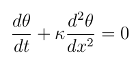

# Problema de Fourier (Trabalho de Equações Diferenciais)
Algoritimo para a resolução e plotagem do gráfico de um problema de Fourier em c++

Considere o problema de Fourier. Dada uma barra de metal de comprimento L e temperatura inicial de 0o = 0 em toda barra.
A barra é submetida em suas extremidades a temperaturas distintas de zero. Sejam os perfis de temperatura que a barra tem ao passar do tempo.
Plotar alguns destes perfis utilizando o método de aproximação descrito abaixo.

onde θ(x, t), 0 ≤ x ≤ L, t ≥ 0. κ é a condutibilidade térmica do metal do qual é composto a barra.
É uma equação diferencial parcial com variáveis independentes x e t.

